# Agentic AI HealthCare Project: DiaVigil -  Diabetic Readmission Risk & Clinical BI Copilot
DiaVigil is an agentic clinical decision-support copilot designed to reduce 30-day diabetic hospital readmissions and help health systems avoid costly Hospital Readmissions Reduction Program (HRRP) penalties. Powered by an comprehensive 3-agent orchestration pipeline, the system uses an in-memory DuckDB database to query structured electronic health records via natural-language SQL (Agent 1), an optimized XGBoost classifier paired with a SHAP TreeExplainer to deliver calibrated risk probabilities and explainable clinical drivers (Agent 2), and Groq Compound to synthesize these insights into executive-ready transition-of-care reports and actionable discharge interventions (Agent 3). By transforming raw EHR data and machine learning predictions into personalized, protocol-aligned clinical guidance, DiaVigil bridges the gap between predictive risk scoring and proactive bedside care.  

## Basic Information
**Name:** N M Emran Hussain  
**Email:** nmemranhussain2023@gmail.com  
**Date:** July 2026  
**Model Version:** 1.0.0  
**License:** [Apache License Version 2.0,](LICENSE)

## Purpose of this Project
- Provide clinical care teams with an automated tool to query complex electronic health records (EHRs) and execute real-time predictive risk scoring.
- Synthesize high-risk patient factors into actionable, executive-level discharge plans to improve transition care.

## Business Problem & Solution
**Problem:**  
- Hospital systems face substantial financial penalties and lower quality ratings under the Hospital Readmissions Reduction Program (HRRP) if diabetic patients are readmitted within 30 days of discharge.
- Medical staff lack integrated tools to simultaneously extract patient data, predict readmission risk, and formulate targeted discharge interventions.  

**Solution:** The project builds an end-to-end pipeline using a 3-agent orchestration system powered by Groq Compound.  

- **Agent 1 (Natural-Language SQL Extractor):** Uses Gemini and an in-memory DuckDB database to parse natural language requests and extract structured patient features (e.g., time in hospital, emergency visits) via SQL.
- **Agent 2 (Clinical ML Predictor):** Trains an XGBoost classifier to predict the 30-day readmission probability and applies a SHAP TreeExplainer to identify the top feature attributions driving the risk.
- **Agent 3 (BI & Executive Synthesizer):** Translates the raw data and machine learning predictions into a structured transition-of-care report containing an executive risk summary, BI reporting metrics, prescribed clinical interventions and cost-benefit analysis in both conservative nad moderate scenario.

## Intended and Out-of-Scope Usage

**Intended Users:** 
- **Clinical Care Teams:** Utilize the system to access real-time predictive risk scoring and synthesize high-risk factors into actionable, executive-level discharge plans.
- **Hospital Administrators:** Leverage the BI dashboarding, cohort visualizations, and cost-benefit analysis outputs to monitor operational hospital logs and quality ratings.
- **Health Data Scientists/Analysts:** Train the XGBoost classifiers and configure the SHAP TreeExplainer to extract local feature contributions and calculate readmission probabilities.
- **MLOps & Data Engineers:** Set up the in-memory DuckDB databases, load diabetic records, and maintain the 3-agent orchestration pipeline using the Groq API.  

**Out-of-scope Uses:**
- **Autonomous Medical Diagnoses:** The system functions strictly as a clinical BI copilot to synthesize data and prescribe targeted transition care plans, not as a replacement for independent physician diagnoses.
- **All-Cause Readmission Predictions:** The database and engineered feature tables are loaded exclusively with diabetic records to calculate 30-day readmission risk specifically for diabetic patients, rather than the general hospital population.
- **Real-Time Emergency Intake Triage:** The workflow evaluates baseline flags like emergency visit frequency to generate clinical transition-of-care reports for discharge planning, rather than managing active acute care during initial emergency room triage. 

## Data Dictionary
**Dataset Name & Source:** [Diabetes Hospital Readmission Dataset](https://www.kaggle.com/datasets/razanihababdellatif/diabetes-hospital-readmission-dataset)  

**Number of Samples:** The dataset contains 101,766 rows (patient encounters) and 50 columns. It is a tabular dataset comprising integers and string object data types.  

**Original Features Used:** time_in_hospital,  num_lab_procedures,  num_medications,  number_emergency.  

**Engineered Features:** A single engineered feature, readmitted_30d, was created using DuckDB SQL to convert the original categorical readmitted variable into a binary flag indicating if a patient was readmitted in less than 30 days.  

**Target Feature:** readmitted_30d  

## Data Dictionary

|Column Name	      |Modeling Role	|Measurement Level	|Description|
|------------------|--------------|------------------|-----------|
|encounter_id	|Identifier	|Nominal	|Unique identifier assigned to the specific hospital encounter.|
|patient_nbr |Identifier |Nominal |Unique identifier assigned to the patient.| 
|time_in_hospital |Feature |Ratio |Total number of days the patient spent in the hospital during the admission.|  
|num_lab_procedures |Feature |Ratio |Total count of laboratory procedures performed on the patient during the encounter.| 
|num_medications |Feature |Ratio |Total count of distinct medications administered to the patient.|
|number_emergency |Feature |Ratio |Frequency of the patient's prior emergency department visits.|
|readmitted_30d |Target |Nominal (Binary) |Engineered flag representing whether the patient was readmitted within 30 days of discharge (1) or not (0).|  

## Training & Test Data

- **Split Ratio:** 80% training data, 20% test data (test_size=0.2).
- **Random State:** Seeded at random_state=42 for reproducibility.
- **Total Dataset Size:** 101,766 patient encounters.
- **Training Set Size:** 81,412 samples.
- **Test Set Size:** 20,354 samples.

## Modeling Details

### Model Type & Methodology

- **Modeling Type:** Binary classification using xgb.XGBClassifier configured with a binary:logistic objective to predict the probability of readmission.  
- **Imbalance Handling:** The methodology directly addresses a severe dataset class imbalance by applying a scale_pos_weight of 7.97. This value represents the ratio of the negative class (non-readmitted) to the positive class (readmitted) and penalizes the model heavier for missing positive cases to improve minority class recall.  
- **Explainability Integration:** The model passes its predictions to a shap.TreeExplainer, which computes SHAP (SHapley Additive exPlanations) values to determine the isolated clinical impact of each feature on the final risk probability.  

### Hyperparameter Tuning Details

- **Search Method:** Exhaustive parameter search using GridSearchCV evaluated over 243 candidates, totaling 729 fits.
- **Validation Strategy:** 3-fold cross-validation (cv=3).
- **Target Scoring Metric:** The grid search was explicitly instructed to optimize for the Area Under the Receiver Operating Characteristic Curve (scoring='roc_auc').

### Parameter Grid Searched

* `n_estimators`: [50, 100, 200]
* `max_depth`: [3, 4, 5]
* `learning_rate`: [0.01, 0.1, 0.2]
* `subsample`: [0.7, 0.8, 0.9]
* `colsample_bytree`: [0.7, 0.8, 0.9]

**Best Parameters Found:** `colsample_bytree`: 0.8, `learning_rate`: 0.1, `max_depth`: 3, `n_estimators`: 50, `subsample`: 0.8

## Quantitative Analysis  

### Evaluation Metrics  
The model was evaluated using a combination of classification metrics and a Confusion Matrix to track true vs. false predictions.  
| Metric     | Score   | 
|-------------|-------|
|Best Cross-Validation ROC AUC | 0.5795 |
|Test Set AUC |0.5748 |
|Accuracy |0.5552 |
|Recall |0.5418 |
|Precision | 0.1339 |
|F1-Score | 0.2147 |  

### **Confusion Matrix Breakdown for Optimized Model:**

| Metric | Count |
| :--- | :--- |
| True Negatives (TN) | 10,062 |
| False Positives (FP) | 8,007 |
| False Negatives (FN) | 1,047 |
| True Positives (TP) | 1,238 |


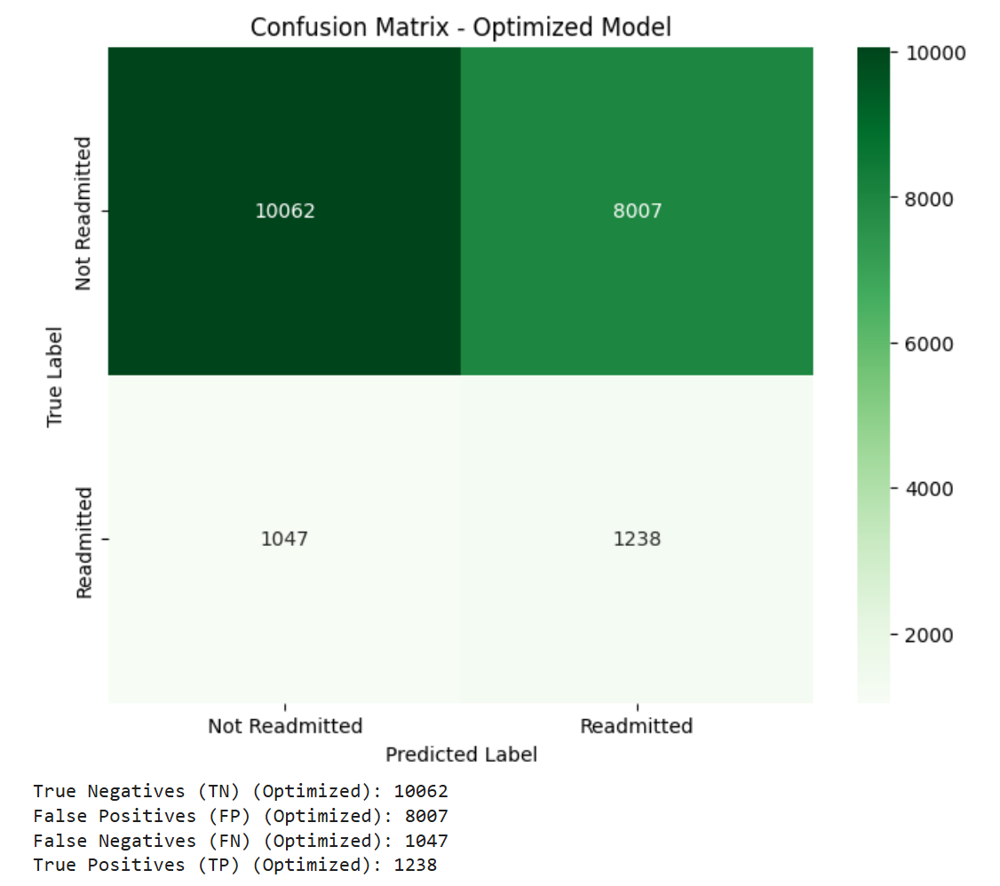 

**Description**: This confusion matrix heatmap for the optimized model evaluates 30-day readmission predictions, showing 10,062 true negatives, 8,007 false positives, 1,047 false negatives, and 1,238 true positives.

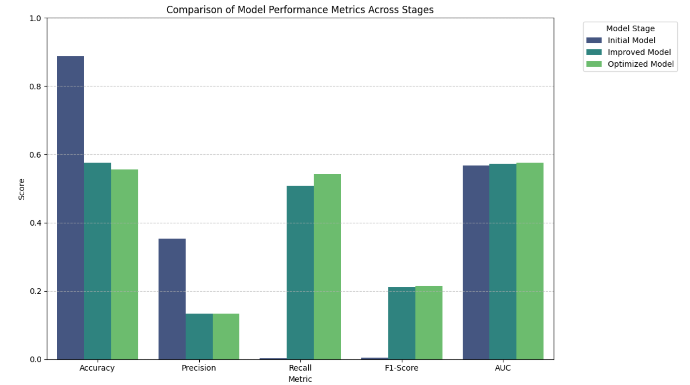 

**Description**: This chart illustrates the progression of model performance across three optimization stages:
- **Stage 1 (Initial Model):** We trained a baseline XGBoost classifier without class weighting, resulting in misleadingly high accuracy (88.75%) but an unviable recall of only 0.26% due to severe class imbalance.
- **Stage 2 (Improved Model):** We addressed class imbalance by introducing scale_pos_weight = 7.97, which penalized positive misclassifications and drastically improved recall to 50.72% and F1-score to 21.13% by trading off accuracy and precision.
- **Stage 3 (Optimized Model):** We conducted exhaustive hyperparameter tuning via GridSearchCV targeting ROC-AUC (tuning tree depth, learning rate, and subsampling), which further elevated recall to 54.18%, F1-score to 21.47%, and test AUC to 0.5748. 

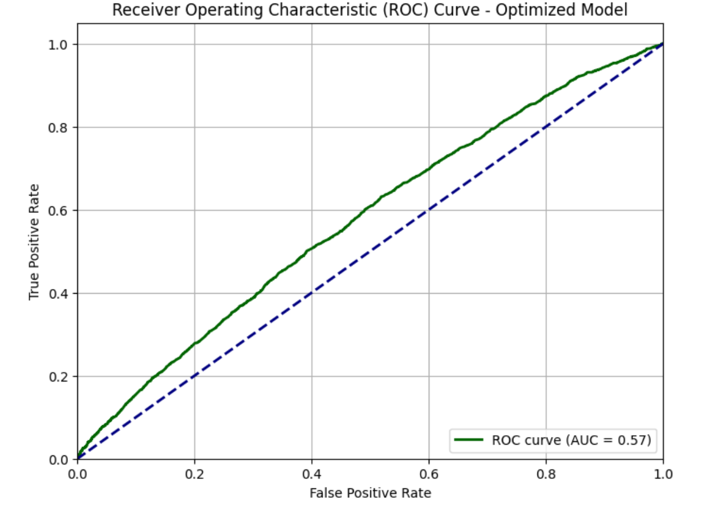 

**Description**: This graph illustrates the Receiver Operating Characteristic (ROC) curve for the final optimized XGBoost model evaluated on the test set, plotting the True Positive Rate against the False Positive Rate across all classification thresholds. The model achieves an Area Under the Curve (AUC) of 0.5748 (rounded to 0.57 in the plot legend), positioning the green curve slightly above the blue dashed diagonal baseline representing random chance (AUC = 0.50). While this score reflects marginal discriminative ability between readmitted and non-readmitted diabetic patients due to relying on only four baseline features and managing severe class imbalance, it represents a step-wise improvement over the baseline model's AUC of 0.5666 and demonstrates better class separation when combined with tuned hyperparameters and class weighting.

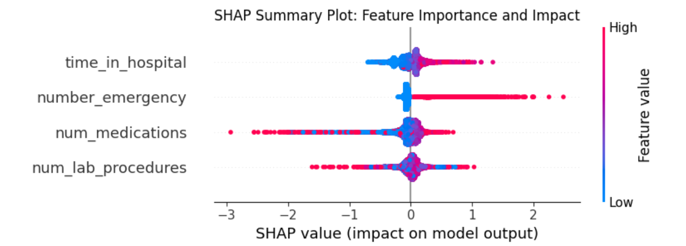 

**Description**: The SHAP summary plot illustrates the magnitude and directional impact of each clinical feature on the predicted 30-day diabetic readmission risk, revealing that longer hospital stays (time_in_hospital) and a higher frequency of prior emergency room visits (number_emergency) strongly push risk scores higher, whereas medication counts (num_medications) and lab procedure frequencies (num_lab_procedures) demonstrate wide, patient-specific variation across risk boundaries. SHAP (TreeExplainer) was incorporated into this project to provide local, patient-level explainability for the black-box XGBoost model, bridging the gap between raw statistical inference and executive clinical reporting. By decomposing individual prediction probabilities into concrete feature attributions, SHAP allows the downstream LLM synthesizer to articulate the exact medical reasons behind a patient's risk tier and prescribe tailored discharge interventions based on those specific drivers.

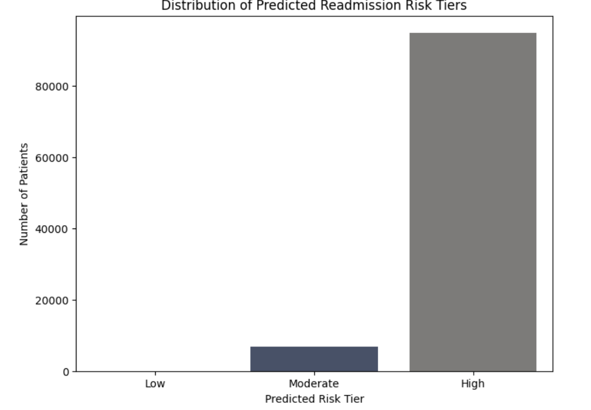 

Patients are segmented into three risk tiers based on predicted patient's readmission probability:
- **High Risk:** Patient's Readmission Probability ≥ 0.40
- **Medium Risk:** 0.20 ≤ Patient's Readmission Probability < 0.40
- **Low Risk:** Patient's Readmission Probability < 0.20

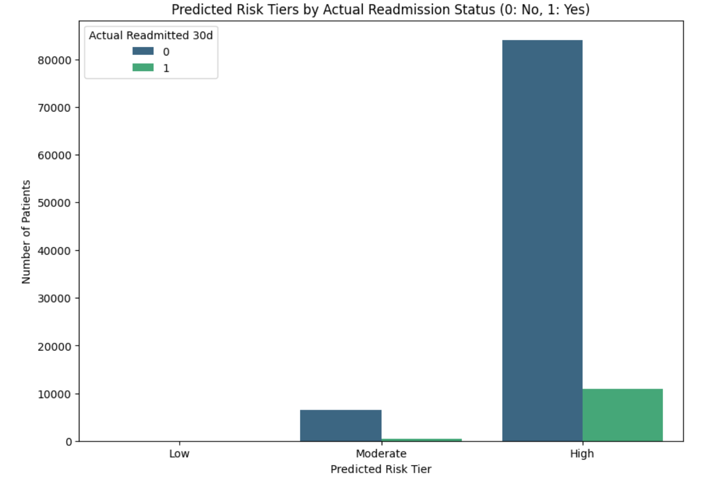 

**Description**: These cohort distribution charts illustrate that the optimized model places the vast majority of the 101,766 patient encounters into the High risk tier (>0.4 predicted probability), with a smaller subset in Moderate (0.2–0.4) and virtually none in Low (<0.2). When stratified by actual 30-day outcomes, the High tier successfully captures nearly all true readmissions (class 1, ~11,000 encounters). However, because scale_pos_weight (7.97) intentionally penalizes missed readmissions to boost recall, it shifts predicted probabilities upward, resulting in over 80,000 non-readmitted patients (class 0) also being categorized as High risk. This underscores the trade-off of the model's high-recall configuration: it effectively flags at-risk patients for clinical intervention but introduces substantial false-positive volume across the patient cohort.

## Cost-Benefit Analysis & ROI Optimization

### Moderate Scenario

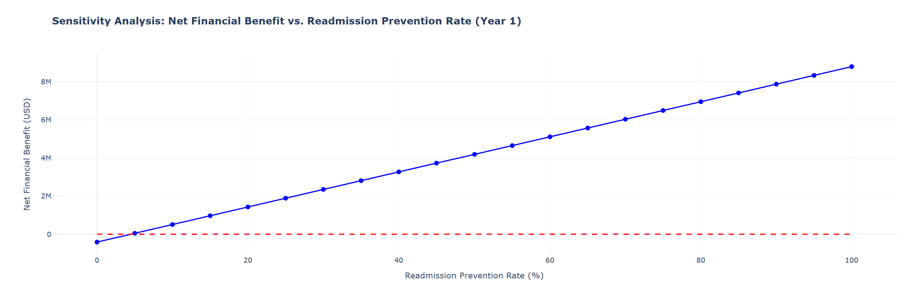

**Description**: This sensitivity analysis illustrates that Year 1 net financial benefit scales linearly with the readmission prevention rate, reaching up to $8.8M at full intervention efficacy. The system crosses the breakeven threshold (red dashed line) at a prevention rate under 5%, confirming strong financial viability even with modest readmission reductions.

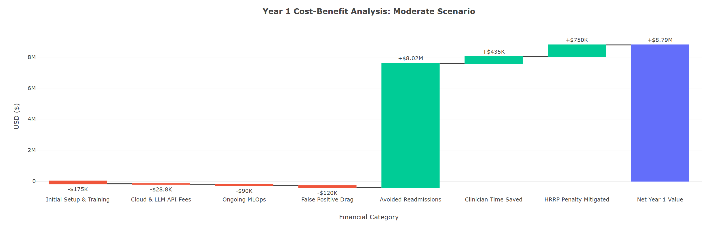

**Description**: This waterfall chart illustrates the Year 1 cost-benefit analysis for the Diabetic Readmission Copilot projects an overwhelmingly positive net financial return of approximately $8.8 million. While the multi-agent system incurs minimal deployment and operational expenses totaling less than $500,000—covering initial setup, cloud API fees, ongoing MLOps, and false positive resource drag—these are heavily outweighed by clinical and administrative savings. The overarching value driver is roughly $7.6 million generated by avoiding costly 30-day readmissions, which is further bolstered by $500,000 in recaptured clinician productivity and $700,000 in mitigated Medicare HRRP penalties, proving substantial economic and clinical viability to hospital leadership.

### Conservative Scenario

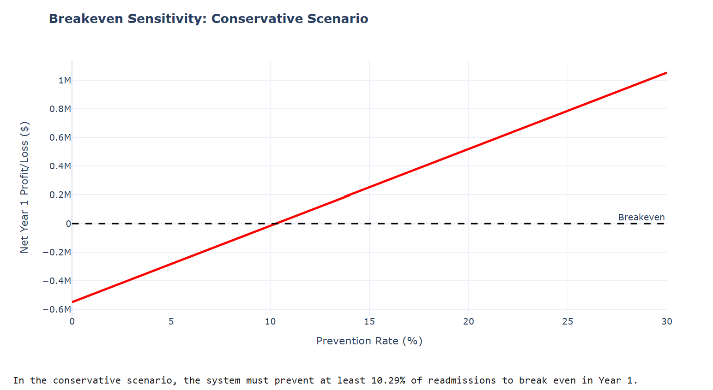
**Description**: The "sensitivity_analysis_conservative_scenario.png" line graph plots the system's financial viability against its clinical success rate. An upward-sloping red line tracks the net Year 1 profit and loss across a prevention rate x-axis ranging from 0 to 30 percent, beginning at a deficit near $600,000 if no readmissions are prevented. The chart indicates that the system crosses the zero-dollar profit dashed line at exactly a 10.29% prevention rate, which is the minimum threshold required to break even in the first year.

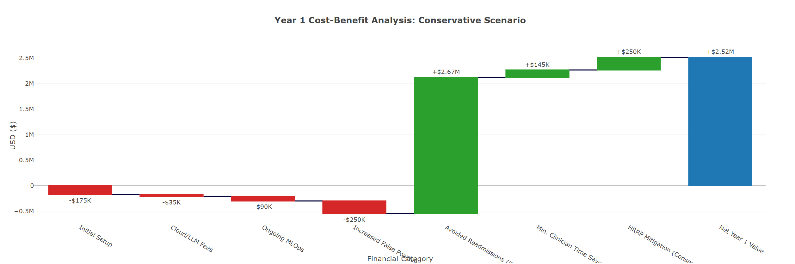
**Description**: The "cost_benefit_conservative.png" waterfall chart models the Year 1 financial impact of the system under conservative assumptions, yielding a projected net positive return of $2.52 million. Operational costs are categorized by red bars, detailing a $175,000 initial setup, $35,000 in Cloud/LLM fees, $90,000 for ongoing MLOps, and a $250,000 drag from increased false positives. These expenses are countered by value drivers in green, heavily anchored by $2.67 million saved through avoided readmissions, supplemented by $145,000 in minimum clinician time saved and $250,000 in mitigated HRRP penalties.

## System Architecture & Data Pipeline 

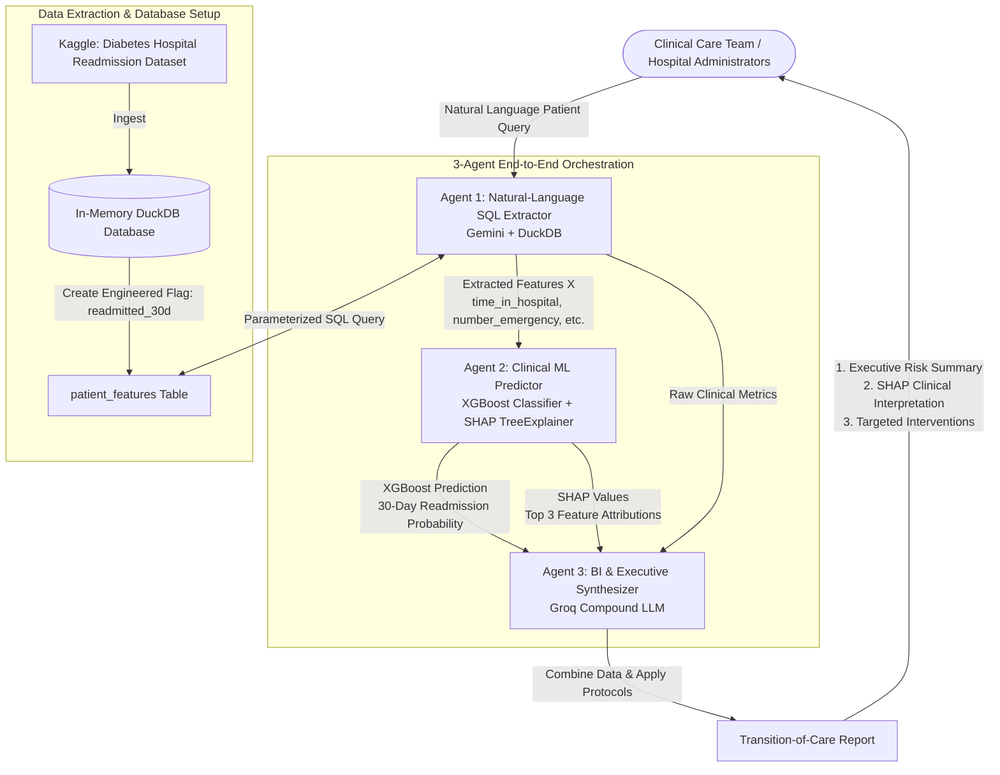
**Description**: System Architecture Diagram

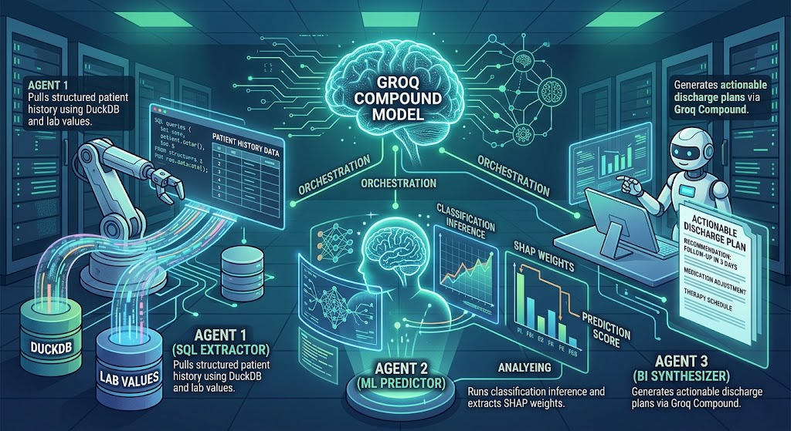
**Description**: 3-Agent Orchestration Workflow
- **Agent 1 (Natural-Language SQL Extractor):** Uses Gemini and an in-memory DuckDB database to parse natural language requests and extract structured patient features (e.g., time in hospital, emergency visits) via SQL.
- **Agent 2 (Clinical ML Predictor):** Trains an XGBoost classifier to predict the 30-day readmission probability and applies a SHAP TreeExplainer to identify the top feature attributions driving the risk.
- **Agent 3 (BI & Executive Synthesizer):** Translates the raw data and machine learning predictions into a structured transition-of-care report containing an executive risk summary, BI reporting metrics, and prescribed clinical interventions. 

### Execution Trace: Patient 55667788

```mermaid

flowchart TD
    %% Input Layer
    Start([Clinician Query: Patient 55667788]) --> Agent1

    %% Agent 1: Data Extraction
    subgraph Step1 [Agent 1: SQL & Data Extractor]
        Agent1[Natural Language Parsing] --> DB[(DuckDB Warehouse)]
        DB -->|Returns JSON Vitals:<br>stay: 7 days | labs: 62<br>meds: 18 | ED visits: 3| Agent2
    end

    %% Agent 2: Machine Learning Inference
    subgraph Step2 [Agent 2: Clinical ML Predictor]
        Agent2[XGBoost Optimized Model] --> Pred[Prediction: 68.48%<br>Risk Tier: High]
        Agent2 --> SHAP[SHAP TreeExplainer]
        SHAP --> Drivers[Top Drivers:<br>1. ED Visits +0.584<br>2. Hospital Stay +0.083<br>3. Medications +0.066]
    end

    %% Agent 3: LLM Synthesis
    Pred --> Agent3
    Drivers --> Agent3
    Protocols[[Hospital Protocols:<br>• SW Consult<br>• 72h Telehealth<br>• Pharmacist Med Rec]] --> Agent3

    subgraph Step3 [Agent 3: BI & Executive Synthesizer]
        Agent3[Groq Compound LLM] --> Synthesis[Contextualize & Format]
    end

    %% Output Layer
    Synthesis --> Output([Final Markdown Output:<br>Targeted Transition-of-Care Brief])

    %% Styling
    classDef agent fill:#0f4c75,stroke:#3282b8,stroke-width:2px,color:#fff,border-radius:5px;
    classDef database fill:#3282b8,stroke:#bbe1fa,stroke-width:1px,color:#fff;
    classDef result fill:#1b262c,stroke:#bbe1fa,stroke-width:1px,color:#fff;
    
    class Agent1,Agent2,Agent3 agent;
    class DB database;
    class Pred,Drivers,Protocols,Synthesis result;
```
**Description**: Patient 55667788 represents a complex, high-risk encounter with a 68.5% probability of a 30-day hospital readmission. The 3-agent DiaVigil pipeline autonomously extracted the patient's clinical history—highlighting a 7-day hospitalization, 18 active medications, and 3 recent emergency visits—and evaluated the risk using the optimized XGBoost model. By translating the raw SHAP feature penalties into clinical context, the Groq LLM successfully synthesized a protocol-aligned discharge plan that mandated critical interventions, including pharmacist-led medication reconciliation and a 72-hour telehealth follow-up, demonstrating the system's end-to-end clinical utility.

### Version of the Modeling Software:
|Package / Environment | Version |
|:----- |:----|
|Python | 3.13  |
|Groq |1.7.0  | 
|anyio |4.14.2 |
| distro |1.9.0  |
|httpx |0.28.1  |
|pydantic |2.13.4  |
|sniffio |1.3.1  |
|typing-extensions |4.16.0 |
|idna |3.19  |
|certifi |2026.7.22  |
|httpcore |1.0.9  |
|h11 |0.16.0 |
|annotated-types |0.8.0 |
|pydantic-core |2.46.4  |
|typing-inspection |0.4.4 |
|plotly |5.24.1 |
|pandas |2.2.3|
|tenacity |9.1.4|
|packaging |26.3 |
|numpy |2.1.3 |
|python-dateutil |2.9.0.post0 |
|pytz |2025.2 |
|tzdata |2026.3 |
|six |1.17.0 |  

## Limitations, Biases & Ethical Considerations

### Technical & Data Limitations

- **Severe Class Imbalance:** The positive target class (readmitted_30d = 1) represents only ~11.16% (11,357 encounters) of the 101,766 total records, while 88.84% are non-readmitted. This severe negative-to-positive ratio (7.97:1) significantly skews model learning toward the majority class.  
- **Constrained Feature Utilization:** Out of 50 available columns in the dataset (including clinical diagnoses diag_1, diag_2, diag_3, HbA1c tests, and 23 specific diabetes medications), the model extracts and trains on only four numerical features (time_in_hospital, num_lab_procedures, num_medications, and number_emergency).  
- **High Sparsity in Clinical Lab Results:** Critical glycemic indicators in the raw dataset suffer from heavy missingness—max_glu_serum contains only 5,346 non-null values and A1Cresult contains only 17,018 non-null records out of 101,766 entries. Because no imputation pipeline was implemented, these primary diabetic markers were excluded from the model.
- **Lack of Longitudinal Patient History:** The dataset treats encounters largely in isolation rather than modeling time-series trends or chronic condition trajectories across multiple historical hospital stays per patient.
- **Low Discriminative Power (AUC):** The baseline XGBoost model achieved an Area Under the Curve (AUC) of only 0.5666. Even after applying scale_pos_weight (7.97) and exhaustive 3-fold GridSearchCV hyperparameter tuning, the test set AUC reached only 0.5748—marginally better than random chance (0.50).
- **High False-Positive Drag:** To improve recall from a baseline of 0.26% to 54.18%, the model trades off precision, which drops to 13.39%. This creates 8,007 false positives against only 1,238 true positives, incurring an estimated $120,000 in annual operational drag due to care coordinators reviewing non-readmission cases.
- **Arbitrary Risk Tier Thresholds:** Risk tier assignments (High if probability > 0.4, Moderate if > 0.2, else Low) are hard-coded heuristics rather than clinically validated decision boundaries optimized for specific hospital cost-versus-recall requirements.
- **In-Memory Non-Persistent Storage:** The data warehouse layer runs in an ephemeral in-memory DuckDB instance (:memory:) inside Google Colab rather than interfacing with an enterprise, distributed data warehouse or live FHIR/HL7 feeds.
- **Static SQL Extraction:** While designed as a natural-language SQL extractor, the implemented agent_sql_extractor executes a static parameterized SQL template with a fixed LIMIT 1 clause rather than dynamically generating complex, multi-table queries from unconstrained clinical dialogue.
- **External LLM Dependency & Latency:** Agent 3 relies on external API calls to Groq (groq/compound) for generative synthesis. In production, this introduces network latency, rate-limiting risks, and compliance considerations regarding transmitting Protected Health Information (PHI) to third-party endpoints.
- **Absence of External Multi-Center Validation:** The model was trained and evaluated strictly on an 80/20 train/test split of a single retrospective US hospital dataset from 1999–2008 without external validation across contemporary health systems or diverse geographic populations.  

### AI Disclosure & Collaboration
- **Large Language Models (Agent 3 - BI & Executive Synthesizer):** The synthesis layer uses the Groq Compound system (groq/compound via the groq 1.7.0 Python SDK) to translate raw tabular data and statistical outputs into structured clinical transition-of-care briefs. Architectural specifications also design for Google Gemini to parse natural language clinical requests into parameterized SQL queries (Agent 1).  
- **Predictive Machine Learning (Agent 2 - Clinical ML Predictor):** Binary risk classification is executed via XGBoost (xgb.XGBClassifier), optimized with scale_pos_weight and GridSearchCV to generate a calibrated 30-day readmission probability.  
- **Explainable AI (XAI):** Model interpretability is handled by SHAP (shap.TreeExplainer), which decomposes tree outputs into local Shapley feature contributions to isolate individual patient risk drivers before passing them to the generative agent.
- **Data & Orchestration Infrastructure:** The project utilizes DuckDB for in-memory SQL extraction, KaggleHub for programmatic dataset ingestion, and Plotly and Seaborn for cohort visualization and financial modeling.
- **Copilot Paradigm (Assistive, Not Autonomous):** The framework is explicitly designated as a Clinical BI Copilot. It does not make autonomous diagnoses or independently discharge patients; instead, it synthesizes electronic health records into executive summaries to assist clinical decision-making.
- **Human-in-the-Loop Clinical Workflows:** Every generated brief prescribes required human actions across specific clinical roles:  Pharmacists are required to conduct medication reconciliations, assess drug-drug interactions, and simplify complex regimens. Social Workers are assigned to evaluate transportation, caregiver support, and socioeconomic factors prior to discharge. Care Coordinators & Physicians are mandated to schedule follow-ups and 72-hour post-discharge telehealth check-ins.
- **Institutional Policy & Protocol Enforcement:** The LLM prompt architecture supports dynamic injection of hospital-specific care guidelines (e.g., mandatory social worker consults and 72-hour telehealth follow-ups for moderate-to-high risk tiers), ensuring the AI's recommendations conform to institutional operating standards. 

### Future Work & Scalability
- **Feature Expansion & Engineering:** We can ingest and engineer features from the remaining raw variables in the dataset—such as primary, secondary, and tertiary diagnosis codes (diag_1, diag_2, diag_3), specific diabetes medications, procedural counts, and demographic indicators—to expand our feature space and boost model discrimination beyond our four baseline metrics.

- **Longitudinal & Time-Series Modeling:** We can incorporate historical encounter trends and multi-admission timelines to model chronic diabetic disease trajectories over time, moving our framework beyond evaluating isolated hospital visits.

- **Clinical Decision Threshold Calibration:** We can move beyond default 0.5 classification boundaries to calibrate decision thresholds around our partner health systems' specific risk tolerance, prioritizing higher recall so our clinicians never miss an at-risk patient.

- **External Multi-Center Validation:** We can benchmark and validate our optimized XGBoost and SHAP pipeline against modern, external hospital datasets to ensure our predictive insights remain robust and generalizable across diverse patient populations.

- **Care Pathway & Protocol Alignment:** We can advance Agent 3's prompt engineering to dynamically align transition-of-care recommendations directly with standardized clinical pathways, local formulary guidelines, and available community health resources.

- **Full Text-to-SQL Automation:** We can upgrade Agent 1 from single-table parameterized execution to full dynamic, multi-table schema querying, enabling our care teams to query complex patient records through open-ended natural language.

- **EHR & Distributed Warehouse Integration:** We can scale our data backbone from an in-memory DuckDB instance to enterprise cloud data warehouses (such as BigQuery or FHIR-compliant data lakes) backed by real-time HL7 and EHR integration pipelines.

- **Interactive Clinician Interface:** We can package our 3-agent orchestration chain into a dedicated hospital dashboard or EHR-embedded workflow tool, putting automated risk scores and synthesized discharge plans directly into our frontline care teams' hands at the point of care.
